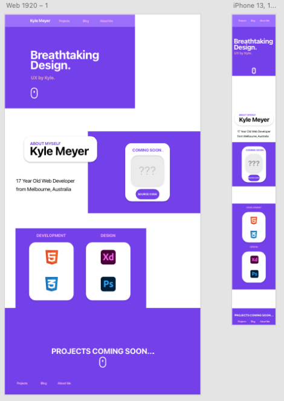
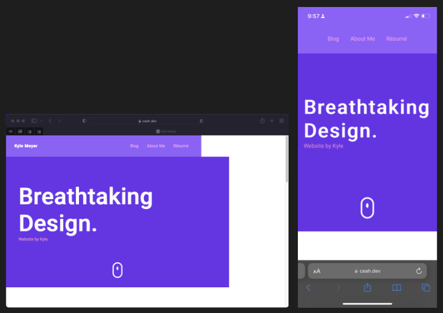

https://stupefied-booth-785a25.netlify.app
 https://github.com/ceahs/personalportfolio

**Breathtaking Design**
 This is a website made by me (Kyle Meyer) It is a portfolio website displaying some information about me, and my website design skills. The website is for future employers who may want to explore my skills such as projects and view my resume. (This website is just a mockup and will not be sent to any employers.)

 

**Functionality/Features**
* Animation on hover on navbars/blog posts
* Navigation buttons on long scrolling pages
* About Me page perfect for NFC chip usage

 

**Sitemap**
 I wanted all pages to be accessible no matter what. I think it makes more sense for a portfolio rather than doing some fancy hidden pages or making certain things avaliable from somewhere. This could only possibly make an employer less happy and more annoyed with my site if they can't find exactly what they need as quick as possible.

 

**Wireframe VS Final Result**
 One thing I was not sure about was if I could produce a result with HTML and CSS to the effect that my wireframes looked like.

 

**Wireframe:**
  

  VS

  

 

**Wow!**
  I managed to do it.

 

**Technologies Used**
* HTML
* CSS
* SCSS
* GIT

 

**Overall, Very happy with how this project turned out.**
